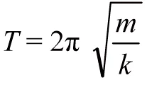
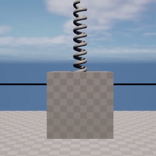
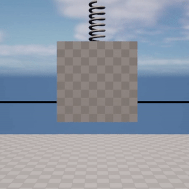
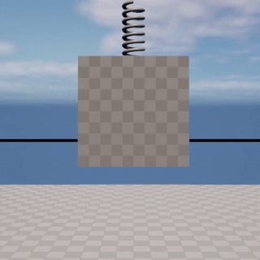
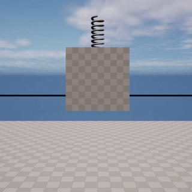
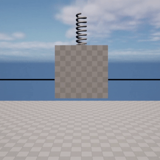
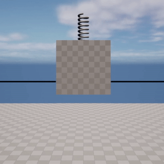
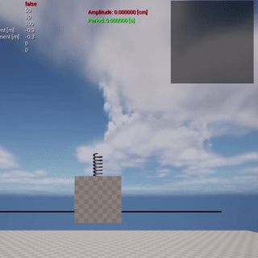

# LyraStarterGameEx1
This document provides an overview of the Simple Harmonic Motion (SHM) simulation implemented in UE5. The simulation involves a spring attached to a cube (mass) in a zero-gravity environment.
 The primary objective is to ensure that the harmonic motion remains consistent across varying frame rates using only physical forces, using sub-stepping technique.

## Simulation
The simulation is based on two main elements:

- Simulation System
- Debug HUD

### Simulation system

It manages the simulation, and consists of the OscillatorSystem script and the respective blueprint BP_OscillatorSystem.
 The system builds the mesh of the Cube used as the mass, and the spring. It also contains all the variables that are exposed and that are necessary to configure the simulation, so

- Cube Mass
- SpringStiffness
- SpringInitialDisplacement
- MaxTrackedValues

Within the BP_OscillatorSystem event graph, the user's keyboard input is managed, which allows to increase/decrease SpringInitialDisplacement using the Num8 and Num2 keys respectively, or start the simulation by pressing the Spacebar. 
 From this point onwards the force required for the SMH is applied in the tick function

#### Computing the force

The force to be applied to the mass is calculated through Hooke's law, where F = -K * DeltaZ.
 DeltaZ is the deviation from the equilibrium position, negative for compression, positive for extension.
 K is the SpringStiffness.

Next are calculated the acceleration for debugging, verifying that it is zero when the body passes through the equilibrium position, and the velocity. This is required to compute the amplitude and period, counting the spikes (i.e., velocity reversals)
and respectively for every 2 spikes, the amplitude is equal to DeltaZ. 
 The period on the other hand is calculated from the number of frames from the previous period multiplied by deltaTime
 Finally, the DeltaZs are stored in an array so that they can be plotted on the graph.

### Debug HUD

The DebugHUD script takes care of building on the left side of the screen the list of the various variables to be debugged, and on the right side the plotting of the graph.
 The first uses the RenderStatistic function, which draws the name and value of the variable on the Canvas.
 The second uses the functions:

- DrawGraphData: takes as input the array of Displacements calculated by the simulation and maps them (inverted for display convenience) within the graph. It then writes the displacement value to the current frame.
- DrawAmplitude: given the amplitude draws it on the graph at the appropriate point and writes its value.
- DrawPeriod: given the period draws the line using the values saved by the OscillatorSystem and writes the value.

## Frame Rate Independency
Frame rate independency ensures that our simulation behaves consistently regardless of the frame rate. My approach for achieving this includes:

- Utilizing time deltas (difference in time between frames) to adjust forces and movements.
- Using and configuring adequately the substepping

## Substepping

Substepping is a technique used to ensure consistent physics simulations even when the frame rate is low. Instead of performing physics calculations once per frame, sub-stepping takes the total frame time and divides it into sub-steps.
The physics simulation is then ticked multiple times per frame. The number of sub-steps taken will depend on how small the max sub-step delta time is set to. 
The smaller the max sub-step time the more stable the simulation will be but at a greater CPU cost.

In this project, the optimal values to ensures consistent behavior across varying frame rates, tra 5 e 60 fps are:

- MaxSubsteps: 6
- Max Substep delta time: 1.

I believe that a "Max Substep Delta Time" value of 1 provides acceptable stability, avoiding numerical unstable problems that might occur with smaller values, leading the system to diverge. 
 The choice made is a good compromise between stability, accuracy and performance.

According to the laws of simple harmonic motion, the period is defined as:

Where m is the mass, k is the spring stiffness

For the following examples, a mass of 50 kg and a spring stiffness of 100 N/m were chosen. 
 As a result, the period of oscillation measures approximately T =  4.44 seconds

 
This section depicts the behavior of the system without having enabled substepping at 60, 30, 15 and 5 FPS, respectively. It can be seen that the oscillation period is inconsistent below 30 frames.

|  |  |    |  |
|:------------------------------------------------------------------------------------------------------------:|:------------------------------------------------------------------------------------------------------------:|:---:|:--:|
|                                       No substep, 60 FPS T: 4.43 s                                       |                                       No substep, 30 FPS T: 4.43 s                                       | No substep, 15 FPS T: 8.86 s | No substep, 5 FPS T: 26.8 s |

In the following part, however, substepping was enabled to make the simulation consistent.
However, if the Max Substep Delta Time is too small, the simulation can become unstable and diverge. This is because the engine is taking too many sub-steps, which can cause the simulation to become inaccurate and unstable.

|  |   | 
| :-----: | :---: | 
| Substep, 15 FPS T: 4.46 s Max Substeps: 6 Max Substep Delta Time: 0.016667 | Substep, 5 FPS T: 8.80 s Max Substeps: 6 Max Substep Delta Time: 0.016667   | 

Finally, as told earlier, it was chosen to use a Max Substep Delta Time equal to 1 in order to have a stable and also quite accurate behavior.

|  |  |  |  |
| :-----: |:--------------------------------------------------------------------------------------------------------------:| :---: | :---: |
| Substep, 60 FPS T: 4.43 s Max Substeps: 6 Max Substep Delta Time: 1 |                Substep, 30 FPS T: 4.43 s Max Substeps: 6 Max Substep Delta Time: 1                 | Substep, 15 FPS T: 4.46 s Max Substeps: 6 Max Substep Delta Time: 1   | Substep, 5 FPS T: 4.40 s Max Substeps: 6 Max Substep Delta Time: 1   |

## Damped String

To simulate damping in the harmonic oscillator, a damping force is added to the physics simulation. Damping force is proportional to the velocity of the object by a damping factor and acts in the opposite direction.
 This contribution adds up to Hooke's law going to determine the resultant force that will be applied.

|  |
|:---------------------------------------------------------------------------------------------------------:|
|                                               Damped Spring                                               |

## Conclusion

Through a combination of frame rate independent calculations and substepping, we've ensured that our project's physics simulations are consistent, accurate, and robust against varying frame rates.
The simulated period is consistent with its theoretical equivalent as well as the other components of the motion.

